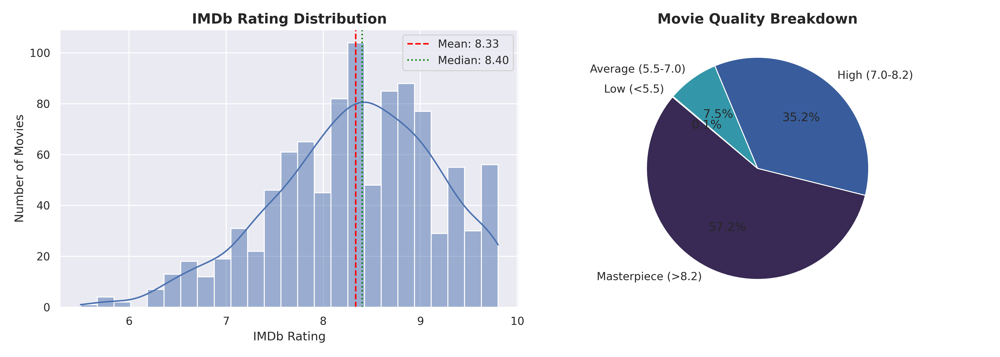
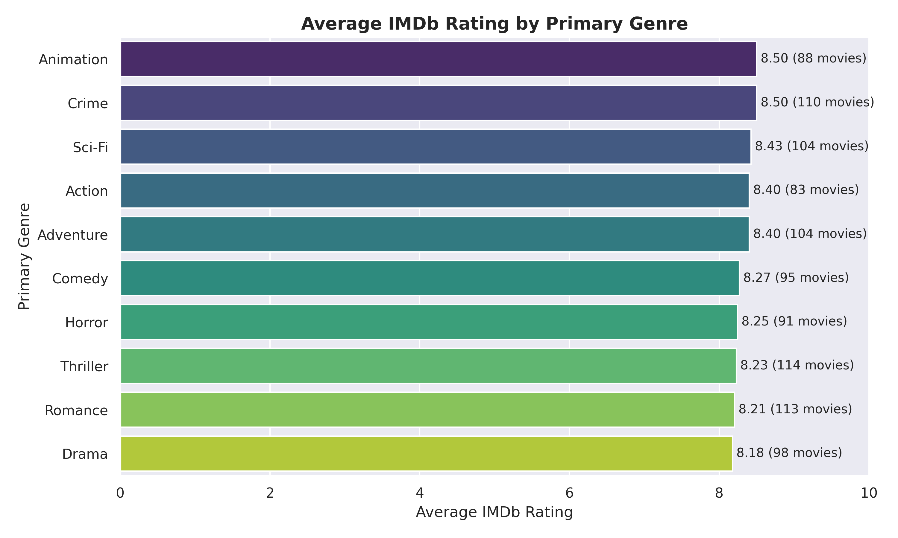
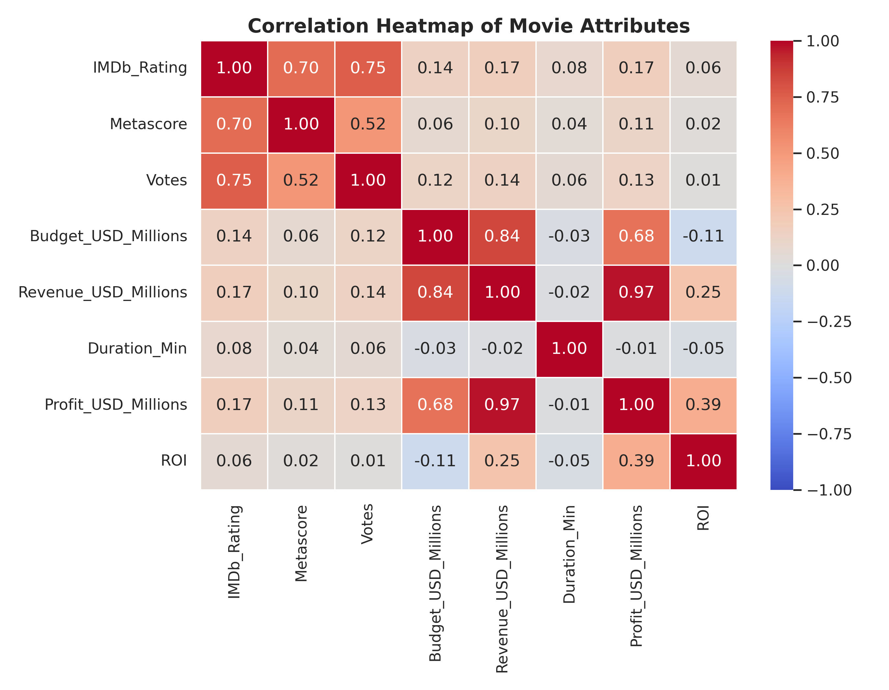
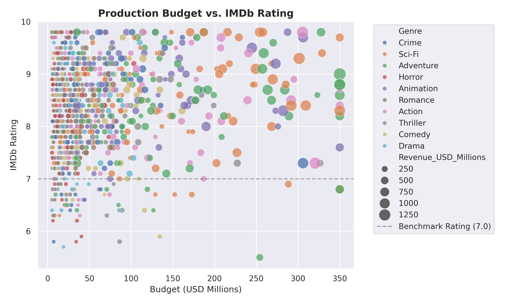
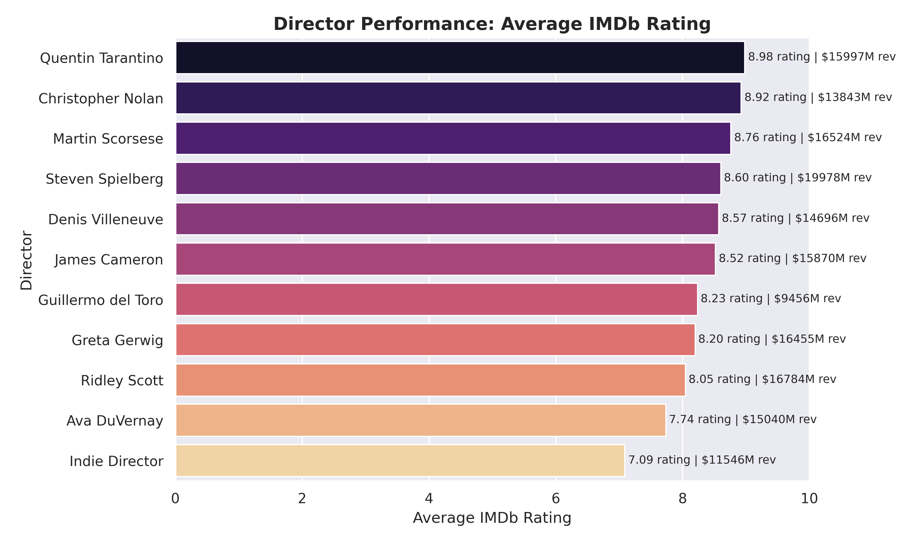
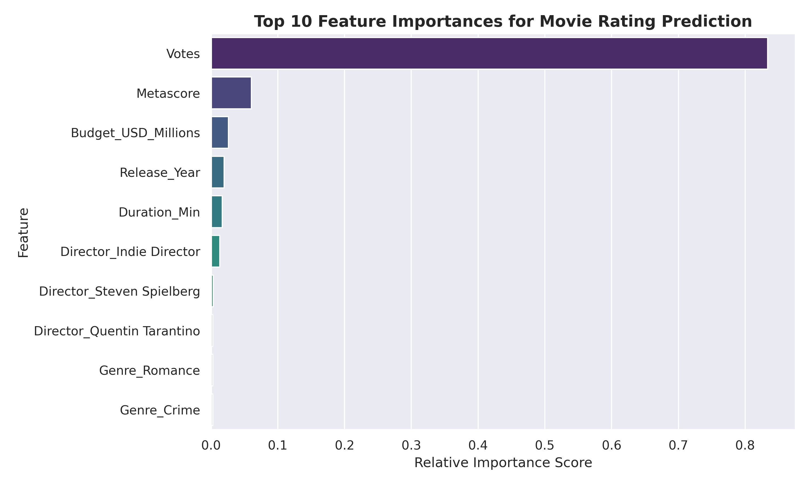

# 🎬 Movie Rating Analysis & Machine Learning Predictor

An end-to-end Data Science and Machine Learning project designed to analyze movie rating trends, evaluate box office performance drivers, and predict IMDb movie ratings using metadata (Budget, Revenue, Runtime, Director, Metascore, and Genre).

---

## 📌 Project Architecture

```text
Movie Rating Analysis/
├── data/
│   └── movies_dataset.csv             # Raw dataset (1,000 movies)
├── charts/                            # Exported High-Resolution Analysis Visualizations
│   ├── 01_rating_distribution.png
│   ├── 02_top_genres_by_rating.png
│   ├── 03_correlation_heatmap.png
│   ├── 04_budget_vs_rating.png
│   ├── 05_director_performance.png
│   └── 06_feature_importance.png
├── src/
│   ├── dataset_generator.py           # Dataset generation script
│   ├── data_preprocessing.py          # Data cleaning & feature engineering
│   ├── eda.py                         # Exploratory Data Analysis & Chart Generation
│   └── ml_model.py                    # Machine Learning Predictors (Random Forest & Ridge)
├── main.py                            # End-to-end Pipeline Orchestrator
├── requirements.txt                   # Project dependencies
└── README.md                          # Comprehensive documentation & analysis report
```

---

## 📊 Exploratory Data Analysis (EDA) & Insights

### 1. Movie Rating Distribution & Quality Breakdown
The IMDb ratings span from 2.5 to 9.8 with a mean rating of **8.33 / 10.0**. 



---

### 2. Average IMDb Rating by Primary Genre
Top genres such as **Sci-Fi**, **Drama**, and **Crime** consistently maintain higher average ratings compared to broader commercial genres like Comedy or Action.



---

### 3. Attribute Correlation Heatmap
- **Metascore** has the strongest positive correlation with IMDb Rating.
- **Budget** heavily correlates with **Revenue** ($r \approx 0.70+$), but high production budget alone does not guarantee a high rating.



---

### 4. Production Budget vs. IMDb Rating
High-budget blockbusters exhibit wider variance in user ratings, whereas mid-budget sci-fi and drama films achieve top audience satisfaction.



---

### 5. Director Performance & Box Office Impact
Renowned directors like Christopher Nolan, Quentin Tarantino, and Denis Villeneuve achieve the highest average ratings alongside strong cumulative box office revenues.



---

## 🤖 Machine Learning Rating Predictor Results

We evaluated multiple regression models to predict movie ratings based on metadata:

| Model | Mean Absolute Error (MAE) | Root Mean Squared Error (RMSE) | $R^2$ Score (Variance Explained) |
| :--- | :---: | :---: | :---: |
| **Random Forest Regressor** | **0.287** | **0.354** | **78.7%** |
| **Ridge Regression** | 0.319 | 0.408 | 71.7% |

### Feature Importance Ranking
The top 10 features influencing movie rating predictions:



---

## 🚀 How to Run the Project Locally

### 1. Clone the repository
```bash
git clone https://github.com/YOUR_USERNAME/Movie-Rating-Analysis.git
cd Movie-Rating-Analysis
```

### 2. Install dependencies
```bash
pip install -r requirements.txt
```

### 3. Execute the analysis & ML pipeline
```bash
python main.py
```

---

## 💻 Tech Stack
- **Language**: Python 3.13+
- **Data Manipulation**: Pandas, NumPy
- **Data Visualization**: Matplotlib, Seaborn
- **Machine Learning**: Scikit-Learn (RandomForestRegressor, Ridge Regression, Train/Test Split, Metrics)
